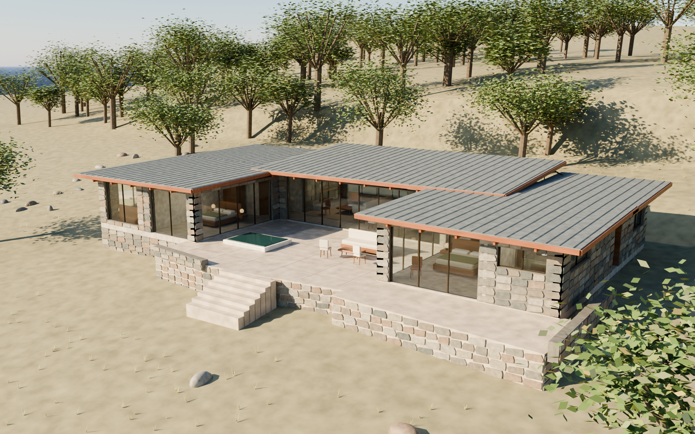

# Lakotah House

An original, furnished architectural concept for **5725 Lakotah Lane, Placerville, California**: **3,503 sq ft, three bedrooms, three bathrooms, an office, and a modern kitchen** around a sheltered courtyard.



## Explore the design

- [Courtyard exterior](renders/01_Courtyard_hero.png)
- [Entry-side exterior](renders/02_Approach.png)
- [Kitchen](renders/03_Kitchen.png)
- [Living room](renders/04_Living.png)
- [Roof-off furnished model](renders/05_Dollhouse.png)
- [Primary bedroom](renders/06_Primary_suite.png)
- [Courtyard from garden level](renders/07_Courtyard_eye_level.png)
- [Measured concept floor plan](drawings/LAKOTAH_floor_plan.png)
- [Schematic site study](drawings/LAKOTAH_site_study.png)

The stone walls, low overlapping roof planes, exposed wood, and linked indoor and outdoor spaces take cues from [Frank Lloyd Wright’s Taliesin West](https://franklloydwright.org/taliesin-west/). This is a new residential design adapted to foothill woodland, with gray standing-seam roof surfaces, walnut interiors, bronze glazing frames, and an angular stone terrace base.

The main bar contains the office, shared bath, living room, dining room, kitchen, pantry and laundry. One wing contains two guest bedrooms and an ensuite bath; the other holds the primary bedroom, bath and walk-in closet. Bedroom 3 uses the shared hall bath. The kitchen includes a roughly 12.5-foot island, four stools, a prep sink, induction cooking, wall ovens and tall refrigeration. A reflecting pool and outdoor seating occupy the court.

## Property basis

The supplied [Zillow listing](https://www.zillow.com/homedetails/5725-Lakotah-Ln-Placerville-CA-95667/195361834_zpid/) and [MetroList listing, MLS 226056226](https://www.metrolistpro.com/homes/2/6/5725-LAKOTAH-LANE-PLACERVILLE-CA-95667/226056226) describe a three-acre downslope parcel with oaks, Lakotah Lane / Highway 49 context, and no utilities listed. The listed parcel number is **006-480-028-000**. These are listing statements, not independently surveyed findings.

The site study traces the [marketing aerial outline](https://photos.zillowstatic.com/fp/bfbafa200d5d39fbcba719e11042d7dd-cc_ft_576.jpg) and normalizes it to the advertised three acres. North is interpreted from that image. The house is placed provisionally toward the Lakotah Lane side, with a proposed northeast-facing court and woodland between the house and the highway.

**Placement, approach, slope direction, elevations, grading and tree locations are schematic.** The model uses an illustrative hillside and a stone plinth beneath one living level. It does not reproduce surveyed terrain. Access rights, utilities, geotechnical conditions, local requirements and buildability remain unverified. These are concept drawings, not construction documents.

## Editable models

| File | Contents |
| --- | --- |
| [LAKOTAH_HOUSE.blend](model/LAKOTAH_HOUSE.blend) | Full furnished Blender scene, woodland, illustrative terrain, materials, lighting and seven cameras. Units: meters. |
| [LAKOTAH_HOUSE.glb](model/LAKOTAH_HOUSE.glb) | Portable furnished house with roofs and terraces. Landscape excluded. Procedural material textures are simplified to base colors. |
| [LAKOTAH_cutaway.glb](model/LAKOTAH_cutaway.glb) | Portable furnished house with roofs removed. |
| [LAKOTAH_shell.FCStd](model/LAKOTAH_shell.FCStd) | FreeCAD architectural shell with named solid parts and a dimension schedule. Units: millimeters. |
| [LAKOTAH_shell.step](model/LAKOTAH_shell.step) | Exchange-format architectural shell. |
| [LAKOTAH_shell_cutaway.FCStd](model/LAKOTAH_shell_cutaway.FCStd) | Roof-off FreeCAD shell. |

In Blender, collection **02 Roofs** controls the roof planes, fascia and roof ribs. Hide it to explore the interior. Collection **05 Landscape** controls the trees and terrain. Cameras 01–07 correspond to the rendered views. The original furnished scene is saved with the roofs visible. For matching renders, use exposure −1.7 for exterior cameras and −0.55 for interior cameras; the build script applies these per view.

The FreeCAD files are simplified BRep shells with separate named components, not a furnished BIM model or a fully constrained sketch-based building system. Furniture, glass, detailed stone relief, terrace detailing, and roof-to-wall clerestory closures are provided in Blender. Rebuild dimensions from the shared source rather than editing the informational FreeCAD schedule.

## Dimensions and verification

The nominal enclosed footprint is **325.4 m² / 3,502.6 sq ft**, measured to exterior wall faces. Courtyard, terraces, decorative stone relief, roof overhangs and landscape are excluded. The overall envelope is **29.00 × 14.20 m / approximately 95 ft 2 in × 46 ft 7 in**. No garage is included in this area or design.

The scripts check the footprint area, three bedrooms and three baths, nonoverlapping room zones, room containment, opening bounds, and a connected route from the entry to each room. FreeCAD solids are checked for validity. Both GLB files are imported back into Blender and compared with the native model bounds. These checks verify concept geometry; they do not establish code compliance or structural performance.

## Rebuild

Sources are in `source/`. `house_spec.py` holds the shared floor geometry; `site_spec.py` holds the explicitly schematic placement and reference basis.

```sh
/Applications/Blender.app/Contents/MacOS/Blender --background --factory-startup --python source/build_house.py
/Applications/FreeCAD.app/Contents/Resources/bin/python source/plan_and_cad.py
/Applications/FreeCAD.app/Contents/Resources/bin/python source/site_plan.py
/Applications/Blender.app/Contents/MacOS/Blender --background --factory-startup --python source/verify_exports.py
```

Run from this folder. Created with Blender 5.2.1 and FreeCAD 1.1.3. The packaged checks record measured values and export readback results.
